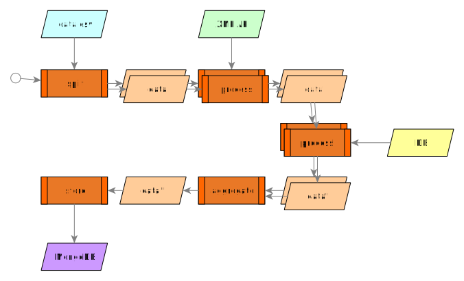

# Camel K Transformations Example
 


This example demonstrates how to transform data with Camel K by showing how to deal with common formats like XML and JSON and how to connect to databases.



We will start by reading a CSV file and loop over each row independently. For each row, we will query an XML API and a database and use all the data collected to build a JSON file. Finally we will collect and aggregate all rows to build a final JSON to be stored on a MongoDB. The final JSON is also a valid [GeoJSON](https://geojson.org/).

## Before you begin

Make sure you check-out this repository from git and open it with [VSCode](https://code.visualstudio.com/).

Instructions are based on [VSCode Didact](https://github.com/redhat-developer/vscode-didact), so make sure it's installed from the VSCode extensions marketplace.

From the VSCode UI, right-click on the `readme.didact.md` file and select "Didact: Start Didact tutorial from File". A new Didact tab will be opened in VS Code.

Make sure you've opened this readme file with Didact before jumping to the next section.

## Preparing the cluster

This example can be run on any OpenShift 4.3+ cluster or a local development instance (such as [CRC](https://github.com/code-ready/crc)). Ensure that you have a cluster available and login to it using the OpenShift `oc` command line tool.

You can use the following section to check if your environment is configured properly.

## Checking requirements

<a href='didact://?commandId=vscode.didact.validateAllRequirements' title='Validate all requirements!'><button>Validate all Requirements at Once!</button></a>

**OpenShift CLI ("oc")**

The OpenShift CLI tool ("oc") will be used to interact with the OpenShift cluster.

[Check if the OpenShift CLI ("oc") is installed](didact://?commandId=vscode.didact.cliCommandSuccessful&text=oc-requirements-status$$oc%20help&completion=Checked%20oc%20tool%20availability "Tests to see if `oc help` returns a 0 return code"){.didact}

*Status: unknown*{#oc-requirements-status}

**Connection to an OpenShift cluster**

You need to connect to an OpenShift cluster in order to run the examples.

[Check if you're connected to an OpenShift cluster](didact://?commandId=vscode.didact.requirementCheck&text=cluster-requirements-status$$oc%20get%20project$$NAME&completion=OpenShift%20is%20connected. "Tests to see if `kamel version` returns a result"){.didact}

*Status: unknown*{#cluster-requirements-status}

We are going to create and use a new project on your cluster to start on a clean environment. This project will be removed at the end of the example.

To create the project, we can use the `oc` tool we just checked:

```
oc new-project camel-transformations
```
([^ execute](didact://?commandId=vscode.didact.sendNamedTerminalAString&text=camelTerm$$oc%20new-project%20camel-transformations&completion=New%20project%20creation. "Opens a new terminal and sends the command above"){.didact})


We'll connect to the `camel-transformations` project and check the installation status:

```
oc project camel-transformations
```
([^ execute](didact://?commandId=vscode.didact.sendNamedTerminalAString&text=camelTerm$$oc%20project%20camel-transformations&completion=Changed%20to%20project%20camel-transformations. "Opens a new terminal and sends the command above"){.didact})

Now we can proceed with the next requirement.

**Apache Camel K CLI ("kamel")**

You need to install the Camel K operator in the `camel-transformations` project. To do so, go to the OpenShift 4.x web console, login with a cluster admin account and use the OperatorHub menu item on the left to find and install **"Red Hat Integration - Camel K"**. You will be given the option to install it globally on the cluster or on a specific namespace.

If using a specific namespace, make sure you select the `camel-transformations` project from the dropdown list.
This completes the installation of the Camel K operator (it may take a couple of minutes).

When the operator is installed, from the OpenShift Help menu ("?") at the top of the WebConsole, you can access the "Command Line Tools" page, where you can download the **"kamel"** CLI, that is required for running this example. The CLI must be installed in your system path.

Refer to the **"Red Hat Integration - Camel K"** documentation for a more detailed explanation of the installation steps for the operator and the CLI.

[Check if the Apache Camel K CLI ("kamel") is installed](didact://?commandId=vscode.didact.requirementCheck&text=kamel-requirements-status$$kamel%20version$$Camel%20K%20Client&completion=Apache%20Camel%20K%20CLI%20is%20available%20on%20this%20system. "Tests to see if `kamel version` returns a result"){.didact}

*Status: unknown*{#kamel-requirements-status}

### Optional Requirements

The following requirements are optional. They don't prevent the execution of the demo, but may make it easier to follow.

**VS Code Extension Pack for Apache Camel**

The VS Code Extension Pack for Apache Camel by Red Hat provides a collection of useful tools for Apache Camel K developers,
such as code completion and integrated lifecycle management. They are **recommended** for the tutorial, but they are **not**
required.

You can install it from the VS Code Extensions marketplace.

[Check if the VS Code Extension Pack for Apache Camel by Red Hat is installed](didact://?commandId=vscode.didact.extensionRequirementCheck&text=extension-requirement-status$$redhat.apache-camel-extension-pack&completion=Camel%20extension%20pack%20is%20available%20on%20this%20system. "Checks the VS Code workspace to make sure the extension pack is installed"){.didact}

*Status: unknown*{#extension-requirement-status}

## 1. Preparing the project

First, make sure we are on the right project:

```
oc project camel-transformations
```
([^ execute](didact://?commandId=vscode.didact.sendNamedTerminalAString&text=camelTerm$$oc%20project%20camel-transformations&completion=Changed%20to%20project%20camel-transformations. "Opens a new terminal and sends the command above"){.didact})

Before you continue, you should ensure that the Camel K operator is installed:

```
oc get csv
```
([^ execute](didact://?commandId=vscode.didact.sendNamedTerminalAString&text=camelTerm$$oc%20get%20csv&completion=Checking%20Cluster%20Service%20Versions. "Opens a new terminal and sends the command above"){.didact})

When Camel K is installed, you should find an entry related to `red-hat-camel-k-operator` in phase `Succeeded`.

You can now proceed to the next section.

## 2. Setting up complementary databases

On this example we are going to use a PostgreSQL database to retrieve data and a MongoDB database to store the output.

```
oc new-app --name="mongodb" --template=mongodb-persistent  \
-e MONGODB_USER=camel-k-example -e MONGODB_PASSWORD=transformations  \
-e MONGODB_DATABASE=example -e MONGODB_ADMIN_PASSWORD=compleexpasswrd
```

([^ execute](didact://?commandId=vscode.didact.sendNamedTerminalAString&text=camelTerm$$oc%20new-app%20--name=%22mongodb%22%20--template=mongodb-persistent%20-e%20MONGODB_USER=camel-k-example%20-e%20MONGODB_PASSWORD=transformations%20-e%20MONGODB_DATABASE=example%20-e%20MONGODB_ADMIN_PASSWORD=compleexpasswrd&completion=MongoDB%20database%20created. "Create MongoDB"){.didact})

Then we create a PostgreSQL database and add some basic dummy data.

```
oc new-app --name="postgres" --template=postgresql-ephemeral \
-e POSTGRESQL_USER=camel-k-example \
-e POSTGRESQL_PASSWORD=transformations \
-e POSTGRESQL_DATABASE=example
```

([^ execute](didact://?commandId=vscode.didact.sendNamedTerminalAString&text=camelTerm$$oc%20new-app%20--name=%22postgres%22%20--template=postgresql-ephemeral%20-e%20POSTGRESQL_USER=camel-k-example%20-e%20POSTGRESQL_PASSWORD=transformations%20-e%20POSTGRESQL_DATABASE=example&completion=PostgreSQL%20Database%20created. "Create PostgreSQL"){.didact})

We connect to the database pod to create a table and add data to be extracted later.

```
oc rsh $(oc get pods -o custom-columns=POD:.metadata.name --no-headers | grep postgresql | grep -v deploy)
```

([^ execute](didact://?commandId=vscode.didact.sendNamedTerminalAString&text=camelTerm$$oc%20rsh%20$(oc%20get%20pods%20-o%20custom-columns=POD:.metadata.name%20--no-headers%20%7C%20grep%20postgresql%20%7C%20grep%20-v%20deploy)&completion=Connected%20to%20pod. "oc rsh pod"){.didact})

```
psql -U camel-k-example example \
-c "CREATE TABLE descriptions (id varchar(10), info varchar(30));
INSERT INTO descriptions (id, info) VALUES ('SO2', 'Nitric oxide is a free radical');
INSERT INTO descriptions (id, info) VALUES ('NO2', 'Toxic gas');"
```

([^ execute](didact://?commandId=vscode.didact.sendNamedTerminalAString&text=camelTerm$$psql%20-U%20camel-k-example%20example%20-c%20%22CREATE%20TABLE%20descriptions%20(id%20varchar(10),%20info%20varchar(30));INSERT%20INTO%20descriptions%20(id,%20info)%20VALUES%20('SO2',%20'Nitric%20oxide%20is%20a%20free%20radical');INSERT%20INTO%20descriptions%20(id,%20info)%20VALUES%20('NO2',%20'Toxic%20gas');%22&completion=Connected%20to%20database%20and%20added%20data. "psql -U camel-k-example example"){.didact})

```
exit
```

([^ execute](didact://?commandId=vscode.didact.sendNamedTerminalAString&text=camelTerm$$exit&completion=Pod%20connection%20closed. "Pod connection closed."){.didact})


## 3. Running the integration

The integration is all contained in a single file named `Transformations.java` ([open](didact://?commandId=vscode.openFolder&projectFilePath=Transformations.java&completion=Opened%20the%20Transformations.java%20file "Opens the Transformations.java file"){.didact}).

Additional generic support classes (customizers) are present in the `customizers` directory, to simplify the configuration of MongoDB, PostgreSQL and the CSV dataformat.

We're ready to run the integration on our `camel-transformations` project in the cluster.

Use the following command to run it in "dev mode", in order to see the logs in the integration terminal:

```
kamel run Transformations.java --dev
```
([^ execute](didact://?commandId=vscode.didact.sendNamedTerminalAString&text=camelTerm$$kamel%20run%20Transformations.java%20--dev&completion=Camel%20K%20transformations%20integration%20run%20in%20dev%20mode. "Opens a new terminal and sends the command above"){.didact})

If everything is ok, after the build phase finishes, you should see the Camel integration running and printing the steps output in the terminal window.

[**To exit dev mode and terminate the execution**, just click here](didact://?commandId=vscode.didact.sendNamedTerminalCtrlC&text=camelTerm&completion=Camel%20K%20transformations%20integration%20interrupted. "Interrupt the current operation on the terminal"){.didact} 
or hit `ctrl+c` on the terminal window.

> **Note:** When you terminate a "dev mode" execution, also the remote integration will be deleted. This gives the experience of a local program execution, but the integration is actually running in the remote cluster.

To keep the integration running and not linked to the terminal, you can run it without "dev mode", just run:

```
kamel run Transformations.java
```
([^ execute](didact://?commandId=vscode.didact.sendNamedTerminalAString&text=camelTerm$$kamel%20run%20Transformations.java&completion=Camel%20K%20transformations%20integration%20run. "Opens a new terminal and sends the command above"){.didact})

After executing the command, you should be able to see it among running integrations:

```
oc get integrations
```
([^ execute](didact://?commandId=vscode.didact.sendNamedTerminalAString&text=camelTerm$$oc%20get%20integrations&completion=Getting%20running%20integrations. "Opens a new terminal and sends the command above"){.didact})

An integration named `transformations` should be present in the list and it should be in status `Running`. There's also a `kamel get` command which is an alternative way to list all running integrations.

> **Note:** the first time you've run the integration, an IntegrationKit (basically, a container image) has been created for it and 
> it took some time for this phase to finish. When you run the integration a second time, the existing IntegrationKit is reused 
> (if possible) and the integration reaches the "Running" state much faster.

Even if it's not running in dev mode, you can still see the logs of the integration using the following command:

```
kamel log transformations
```
([^ execute](didact://?commandId=vscode.didact.sendNamedTerminalAString&text=camelTerm$$kamel%20log%20transformations&completion=Show%20integration%20logs. "Opens a new terminal and sends the command above"){.didact})

The last parameter ("transformations") is the name of the running integration for which you want to display the logs.

[**Click here to terminate the log stream**](didact://?commandId=vscode.didact.sendNamedTerminalCtrlC&text=camelTerm&completion=Camel%20K%20transformations%20integration%20interrupted. "Interrupt the current operation on the terminal"){.didact} 
or hit `ctrl+c` on the terminal window.

Closing the log does not terminate the integration. It is still running, as you can see with:

```
oc get integrations
```
([^ execute](didact://?commandId=vscode.didact.sendNamedTerminalAString&text=camelTerm$$oc%20get%20integrations&completion=Getting%20running%20integrations. "Opens a new terminal and sends the command above"){.didact})

> **Note:** Your IDE may provide an "Apache Camel K Integrations" panel where you can see the list of running integrations and also open a window to display the logs.

## 4. Uninstall

To cleanup everything, execute the following command which will remove the project from OpenShift and drop all resources related to it.

```
oc delete project camel-transformations
```

([^ execute](didact://?commandId=vscode.didact.sendNamedTerminalAString&text=camelTerm$$oc%20delete%20project%20camel-transformations&completion=Removed%20the%20project%20from%20the%20cluster. "Cleans up the cluster after running the example"){.didact})
